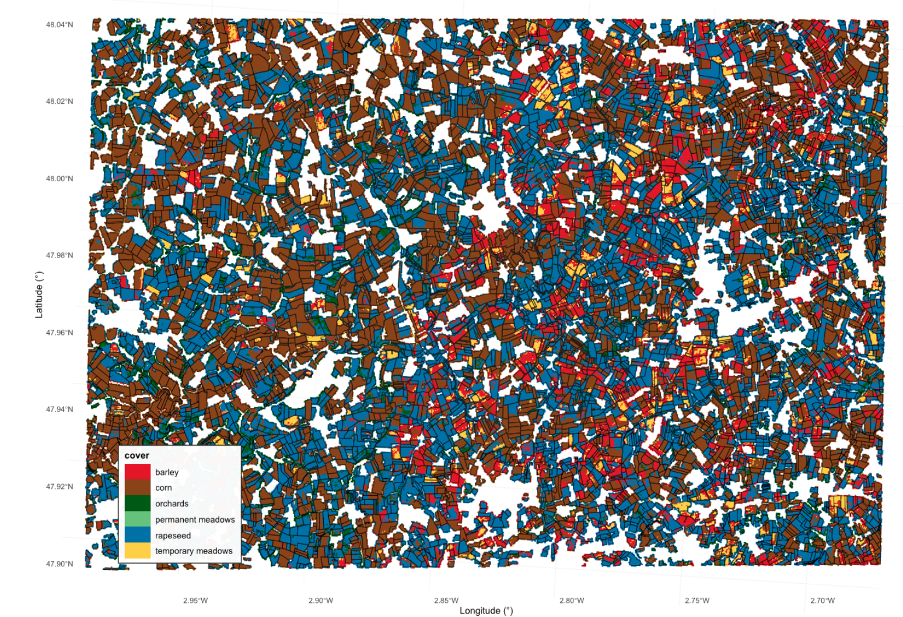

# Summary
OpenEOcubes is an open-source R package that provides a modular environment for preprocessing, modeling, and predicting remote sensing data. It is part of the OpenEO ecosystem and uses a cloud-based approach to process Earth observation data [@Pondi2024]. Established machine learning and deep learning algorithms for spatio-temporal classification and regression tasks are used for modeling. The package is aimed at people interested in remote sensing who are looking for a compact, modular workflow for prediction or model acquisition. OpenEOcubes closes a gap in the cross-platform processing of EO data cubes with feature engineering, model training, and raster inference via a unified declarative OpenEO interface.     

# Statement of need 
Remote sensing workflows often face challenges in terms of data manageability, reproducibility, and interoperability across platforms and programming languages.
Existing tools for analyzing and modeling Earth observation data usually rely on a multi-stage processing chain in which preprocessing, model training, and model inference are separated from each other. OpenEOcubes addressed this issue by integrating separate modules for the client, which are processed in a bundled form as an acyclic JSON process graph on the server [@Pondi2024]. The focus here was on cloud-based querying of satellite data using the Spatio Temporal Asset Catalog (STAC) and data fusion in an Earth Observation Data Cube with analyzable data. However, model training and model inference still had to be serialized in external tools and user-defined code. OpenEOcubes-2 closes this gap with integrated components for machine and deep learning for spatio-temporal classification and regression.
With OpenEOcubes-2, users can extract spatio-temporal features from a four-dimensional data cube in combination with training-specific data. Classic machine learning algorithms such as Random Forest, Support Vector Machine, or XGBoost and deep learning algorithms such as Temporal Convolutional Neural Network (TempCNN), Multi-Layer Perceptrons (MLP), and Light Temporal Attention Encoder (LightTAE) are offered for model training. For reusability, the created model can be exported to the interoperable ONNX format. In addition, it is possible to save the model metadata in a standardized STAC-MLM format. The ML and ONNX models generated in this way can also be used directly for predictions on a raster cube. Both R and Python can be used as clients.
 

# The processes specific to model training/inference

| Process name | Description | Type | Output |
|--------------|-------------|------|--------|
| mlm_class_svm | SVM – classification | ML model | model parameters |
| mlm_regr_svm | SVM – regression | ML model | model parameters |
| mlm_class_random_forest | Random Forest – classification | ML model | model parameters |
| mlm_regr_random_forest | Random Forest – regression | ML model | model parameters |
| mlm_class_xgboost | XGBoost – classification | ML model | model parameters |
| mlm_regr_xgboost | XGBoost – regression | ML model | model parameters |
| mlm_class_tempcnn | TempCNN – classification | DL model | model parameters |
| mlm_class_lighttae | LightTAE – classification | DL model | model parameters |
| mlm_class_mlp | MLP – classification | DL model | model parameters |
| aggregate_spatial | Aggregates cube values over geometries | Preprocessing | table |
| ml_fit | Trains ML/DL model on extracted features | Training | trained model |
| ml_predict | Predicts class values on cube | Inference | prediction cube |
| save_ml_model | Exports model to ONNX format | Persistence | ONNX model |
| load_ml_model | Loads existing model from URL | Persistence | ML model |
| load_stac_ml  | Loads a STAC-MLM model | Persistence | ML model |

# Example outputs
To illustrate the capabilities of OpenEOcubes, an example workflow for model training with a TempCNN on a Sentinel-2 L2A time series is presented. Figure 1 shows a land cover classification from the generated TempCNN model, exported to ONNX and predicted with `ml-predict`.  

  

    
     
    <em>Figure 1: Land cover classification (TempCNN)</em>
  

  

    <pre style="
      background: #f5f5f5;
      padding: 10px;
      border-radius: 8px;
      font-size: 70%;
      line-height: 1.15;
    "><code># Load required libraries

tempcnn <- p$mlm_class_tempcnn(
  cnn_layers = list(256L,256L,256L),
  cnn_kernels = list(7L,7L,7L),
  cnn_dropout_rates = list(0.2,0.2,0.2),
  dense_layer_nodes = 256L,
  dense_layer_dropout_rate = 0.5,
  epochs = 100L, batch_size = 64L,
  optimizer = "adam", learning_rate = 1e-3,
  seed = 42L
)

training_dat <- p$aggregate_spatial(
  data = datacube_crop,
  geometries = training_data,
  reducer = "mean"
)

model <- p$ml_fit(
  model = tempcnn,
  training_set = training_dat,
  target = "Label"
)

save <- p$save_ml_model(model, "tempcnn_test",
                        tasks = list("classification"))

prediction_mlp <- p$ml_predict(
  data  = datacube_aoi,
  model = save
)

result_predict <- p$save_result(
  data   = prediction_mlp,
  format = formats$output$GTiff
)
tempcnn_result  <- compute_result(result_predict)
    </code></pre>
  

The process graph completed the inference after 5 minutes and 36 seconds. In addition to GeoTIFF, the output can also be saved as NetCDF or in Zarr format.
 

# Acknowledgements

# References

