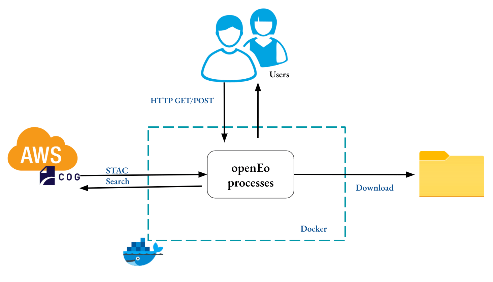

# OpenEOcubes: OpenEO Compliant Lightweight R Platform for Processing Time Series Satellite Images

The service integrates STAC API, OpenEO standards, and gdalcubes to be a lightweight platform to enable analysis of time series satellite images via OpenEO Compliant RESTful endpoints using R-Client. It also supports users to run their custom R functions.

####  Motivation for the platform:
The service tries to improve on the limitations of  established EO data management platforms like Google Earth Engine and Sentinel Hub by supporting:
* Reproducibility of Science
* Extensibility
* Infrastructure Replicability
* Open Governance
* No Need for User Management
* User-Defined R Functions
* Flexibility - Custom CRS, and Quick Resampling of Massive EO Data




After processing the data , one can  download and explore on open source tools like QGIS, R, Python, etc.

## Easy Deployment from DockerHub
Assuming you have Docker installed. This is the easiest approach.
You can get a hosted Docker image of the platform on DockerHub
https://hub.docker.com/r/brianpondi/openeocubes

### Running the container
It is highly recommended to deploy the service on an AWS EC2 machine that is in us-west-2 region (Oregon) as that is the data centre where the Earth Observation(EO) datasets found in AWS STAC search are stored. This enables the processing of EO data from the source so that the network latency between the platform and data is as low as possible hence cheaper. You can expose port 8000 of the EC2 instance to deploy and communicate with the service.
```bash
docker run -p 8000:8000  --env AWSHOST=<AWS-IPv4-ADDRESS>  brianpondi/openeocubes
```

For light tasks and processes you can host the service on pc and therefore you don't need AWS IPv4 Address

```bash
docker run -p 8000:8000  brianpondi/openeocubes
```

## Easy Deployment with Docker
If you want to change the source code then this approach is recommended.
You first need to clone the repository via this command:

```bash
git clone https://github.com/PondiB/openeocubes.git
```

then you can change to that directory

```bash
cd openeocubes
```


Run it :

```bash
docker-compose up
```

Run in detached mode :

```bash
docker-compose up -d
```

Shutting it down:

```bash
docker-compose down
```

Force restart  and rebuild:

```bash
docker-compose up --build --force-recreate --no-deps -d
```

If there are new changes on the images or Dockerfiles:
```bash
docker-compose build --no-cache && docker-compose up
```
