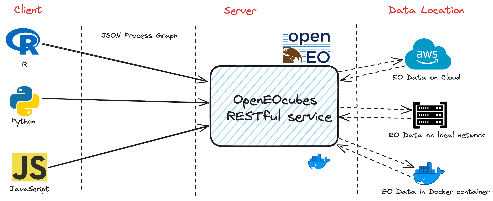

# OpenEOcubes: openEO Compliant Lightweight R Platform for Processing Satellite Image Time Series 

The service integrates STAC API (using Rstac package), the OpenEO standardized API, and data cubes concepts (using gdalcubes R package) to be a lightweight platform to enable analysis of time series satellite images via OpenEO Compliant RESTful endpoints using R, Python and JavaScript Clients. It also supports users to run their custom R functions.

####  Motivation for the platform:
The service tries to improve on the limitations of  established EO data management platforms like Google Earth Engine and Sentinel Hub by supporting:
* Reproducibility of Science
* Extensibility
* Infrastructure Replicability
* Open Governance
* No Need for User Management
* User-Defined R Functions
* Flexibility - Custom CRS,Quick Resampling of 'Large' EO Data




After processing the data , one can  download and explore on open source tools like QGIS, R, Python, etc.


####  Future developments:
Geospatial Machine Learning APIs for time-series EO Data:
* ML APIs e.g. Random Forest, SVM, XGBoost, etc.
* DL APIs e.g. TempCNN, ResNet, LSTM etc.

Currently, PoC for ML APIs is being worked under the [Open Earth Monitor Cyberinfrastructure](https://earthmonitor.org/) EU funded project.
## Easy Deployment from DockerHub
Assuming you have Docker installed. This is the easiest approach.
You can get a hosted Docker image of the platform on DockerHub
https://hub.docker.com/r/brianpondi/openeocubes

### Running the container
It is highly recommended to deploy the service on an AWS EC2 machine that is in us-west-2 region (Oregon) as that is the data centre where the Earth Observation(EO) datasets found in AWS STAC search are stored. This enables the processing of EO data from the source so that the network latency between the platform and data is as low as possible hence cheaper. You can expose port 8000 of the EC2 instance to deploy and communicate with the service.
```bash
docker run -p 8000:8000  --env AWSHOST=<AWS-IPv4-ADDRESS>  brianpondi/openeocubes
```

For light tasks and processes you can host the service on pc and therefore you don't need AWS IPv4 Address

```bash
docker run -p 8000:8000  brianpondi/openeocubes
```

## Easy Deployment with Docker
If you want to change the source code then this approach is recommended.
You first need to clone the repository via this command:

```bash
git clone https://github.com/PondiB/openeocubes.git
```

then you can change to that directory

```bash
cd openeocubes
```


Run it :

```bash
docker-compose up
```

Run in detached mode :

```bash
docker-compose up -d
```

Shutting it down:

```bash
docker-compose down
```

Force restart  and rebuild:

```bash
docker-compose up --build --force-recreate --no-deps -d
```

If there are new changes on the images or Dockerfiles:
```bash
docker-compose build --no-cache && docker-compose up

```

## Development Notes:
While developing, you can skip rebuilding the docker container everytime. Instead you can run the server locally. 
Just run "Rscript startLocal.R" inside this directory.

This will compile this Repository as a R Package and start the server.

## Getting Started:

### Example 1:  NDVI Script in R-Studio using OpenEO R-Client
Using openeo client version 1.3.0, the R scripts provided below calculate a 1-year period NDVI in a section of Amazonia in Brazil. 

```bash
library(openeo)

# connect  to the back-end when deployed locally
 con = connect("http://localhost:8000")
# connect  to the back-end when deployed on aws
# con = connect("http://<AWS-IPv4-ADDRESS>:8000")

# basic login with default params
login(user = "user",
      password = "password")

# get the collection list
collections = list_collections()

# to check description of a collection
collections$`sentinel-s2-l2a-cogs`$description

# Check that required processes are available.
processes = list_processes()

# to check specific process e.g. ndvi
describe_process(processes$ndvi)

# get the process collection to use the predefined processes of the back-end
p = processes()

# load the initial data collection and limit the amount of data loaded
datacube_init = p$load_collection(id = "sentinel-s2-l2a-cogs",
                                spatial_extent = list(west = -7338335,
                                                      south = -1027138,
                                                      east = -7329987,
                                                      north = -1018790,
                                                      crs = 3857),
                                temporal_extent = c("2022-01-01", "2022-12-31"))

# filter the data cube for the desired bands
datacube_filtered = p$filter_bands(data = datacube_init, bands = c("B04", "B08"))

# aggregate data cube to a year
datacube_agg = p$aggregate_temporal_period(data = datacube_filtered, period = "year", reducer = "median")

# ndvi calculation
datacube_ndvi = p$ndvi(data = datacube_agg, red = "B04", nir = "B08")

# supported formats
formats = list_file_formats()

# save as GeoTiff or NetCDF
result = p$save_result(data = datacube_ndvi, format = formats$output$GTiff)

# Process and download data synchronously
start.time <- Sys.time()
compute_result(graph = result, output_file = "amazonia_2022_ndvi.tif")
end.time <- Sys.time()
time.taken <- end.time - start.time
time.taken
print("End of processes")

```

Visualization of the output from the above process:


### Example 2:  BFAST change detection in R-Studio using OpenEO R-Client
Using openeo client version 1.3.0, the R scripts provided below has a user-defined function that uses bfast library to monitor changes on time series of Sentinel-2 imagery from 2016 to 2020. The study area is the region around the new Berlin-Brandenburg Tesla Gigafactory. You can run the  code on your R-studio. 

```bash
library(openeo)

# connect  to the back-end when deployed locally
 con = connect("http://localhost:8000")
# connect  to the back-end when deployed on aws
#con = connect("http://<AWS-IPv4-ADDRESS>:8000")

# basic login with default params
login(user = "user",
      password = "password")

# get the collection list
collections = list_collections()

# to check description of a collection
collections$`sentinel-s2-l2a-cogs`$description

# check that required processes are available.
processes = list_processes()

# to check specific process e.g. filter_bands
describe_process(processes$filter_bands)

# get the process collection to use the predefined processes of the back-end
p = processes()

# load the initial data collection and limit the amount of data loaded
datacube_init = p$load_collection(id = "sentinel-s2-l2a-cogs",
                                  spatial_extent = list(west = 416812.2,
                                                        south = 5803577.5,
                                                        east = 422094.8,
                                                        north = 5807036.1,
                                                        crs = 32633),
                                  temporal_extent = c("2016-01-01", "2020-12-31"))

# filter the data cube for the desired bands
datacube_filtered = p$filter_bands(data = datacube_init, 
                                          bands = c("B04", "B08"))
# aggregate data cube to monthly
datacube_agg = p$aggregate_temporal_period(data = datacube_filtered, 
                            period = "month", reducer = "median")

# user defined R function - bfast change detection method
change_detection = 'function(x) {
  knr <- exp(-((x["B08",]/10000)-(x["B04",]/10000))^2/(2))
  kndvi <- (1-knr) / (1+knr)
  if (all(is.na(kndvi))) {
    return(c(NA,NA))
  }
    kndvi_ts = ts(kndvi, start = c(2016, 1), frequency = 12)
    library(bfast)
    tryCatch({
        result = bfastmonitor(kndvi_ts, start = c(2020,1), level = 0.01)
        return(c(result$breakpoint, result$magnitude))
      }, error = function(x) {
        return(c(NA,NA))
      })
  }'

# run udf
datacube_udf = p$run_udf(data = datacube_agg, udf = change_detection, context =  c("change_date", "change_magnitude"))

# supported formats
formats = list_file_formats()

# save as GeoTiff or NetCDF
result = p$save_result(data = datacube_udf, format = formats$output$NetCDF)

# Process and download data synchronously
start.time <- Sys.time()
compute_result(graph = result, output_file = "detected_changes.nc")
end.time <- Sys.time()
time.taken <- end.time - start.time
time.taken
print("End of processes")

```

Visualization of the output from the above process:


## Citation:

If you use this codebase, or otherwise found our work valuable, please cite:

```bibtex
@Article{Pondi2024,
author={Pondi, Brian
and Appel, Marius
and Pebesma, Edzer},
title={OpenEOcubes: an open-source and lightweight R-based RESTful web service for analyzing earth observation data cubes},
journal={Earth Science Informatics},
year={2024},
month={Feb},
day={19},
abstract={In recent decades, Earth Observation (EO) systems have seen remarkable technological advancements, leading to a surge in Earth-orbiting satellites capturing EO data. Cloud-based storage solutions have been adopted to manage the increasing data volume. Although numerous EO data management and analysis platforms have emerged to accommodate this growth, many suffer from limitations like closed-source software, leading to platform lock-in and restricted functionalities, restricting the scientific community from conducting open and reproducible research. To tackle these issues, we present OpenEOcubes, a lightweight EO data cubes analysis service that embraces open-source tools, standardized APIs, and containerized deployment, we demonstrate the service's capabilities in two user scenarios: performing vegetation analysis in Amazonia, Brazil for one year, and detecting changes in a forested area in Brandenburg, Germany based on five years of EO data.OpenEOcubes is an easy-to-deploy service that empowers the scientific community to reproduce small and medium-sized EO scientific analysis while aggregating over a potentially huge amount of data. It enables the extension of functionalities and validation of analysis carried out on different EO data processing platforms.},
issn={1865-0481},
doi={10.1007/s12145-024-01249-y},
url={https://doi.org/10.1007/s12145-024-01249-y}
}


```